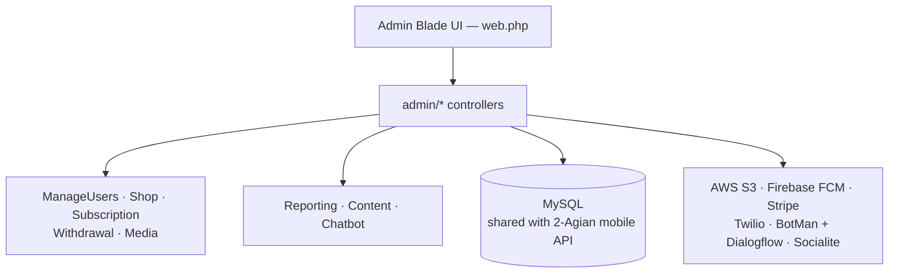

# 2Again Admin Panel

Full-featured **admin panel and REST API backend** for the 2Again social/dating mobile application. Manages users, virtual currency (gold & silver coins), gifting, subscriptions, Stripe payments, AWS S3 media, Firebase push notifications, and a BotMan + Google Dialogflow chatbot.


## Features

- **User Management** — view, ban (timed/permanent), unban, soft-delete; breakdown by VIP/Big Spender/Custom/General tiers
- **Virtual Economy** — gold coin + silver coin balances; shop item management (coin packages, prices); silver-to-fiat conversion rate; per-action earn/deduct rules
- **Subscriptions & Offers** — VIP/BS/Custom badge management; user subscription assignment with expiry; time-limited offers
- **Gifting & Wishlist** — gift/invitation catalogue; sent/received tracking; wishlist management
- **Withdrawal Processing** — silver coin to fiat withdrawals; approve/decline workflow
- **Content Management** — 29+ languages, countries, religions, genders, hobbies, FAQs, safety tips, privacy/terms pages
- **Chatbot** — BotMan + Google Dialogflow for automated user support
- **Media** — AWS S3 upload, private/public flags, soft-delete
- **Push Notifications** — Firebase FCM to users
- **Reporting** — user reports with reasons; admin dashboard stats (users, online, banned, today's registrations)

## Database Schema

| Table | Key Columns | Purpose |
|---|---|---|
| `users` | `id` (UUID), `name`, `email`, `phone`, `gender_id`, `dob`, `gold_coin`, `silver_coin`, `filter_radius`, `profile_pic`, `deleted_at` | User profiles |
| `media` | `user_id`, `media_type`, `is_private`, `name` | S3 media references |
| `likes` | `like_from`, `like_to`, `like_type` | Likes between users |
| `connections` | `send_from`, `send_to` | Mutual matches |
| `messages` | `connection_id`, `send_from`, `send_to`, `type`, `text` | Chat messages |
| `gifts_invitations` | `name`, `type`, `price`, `silver_coin`, `icon` | Gift catalogue |
| `shops` | `type`, `quantity`, `price`, `is_active` | Coin packages |
| `coin_settings` | `item`, `deduct_gold_coins`, `earn_silver_coins` | Economy rules |
| `subscriptions` | `name`, `shortcode`, `badge` | Subscription tiers |
| `user_subscriptions` | `user_id`, `subscription_id`, `valid_till` | Active subscriptions |
| `withdrawals` | `user_id`, `coins`, `amount`, `conversion_rate`, `is_approved` | Withdrawal requests |
| `in_app_transactions` | `user_id`, `source`, `type`, `amount` | Payment ledger |
| `app_settings` | `shortcode`, `value1`, `value2` | Global config KV |
| `countries` | full country data with `latitude`, `longitude`, `emoji` | Reference data |

## Architecture



> Mobile app API routes live in the sister repo `2-Agian` (shared same database).

## Getting Started

```bash
composer install
cp .env.example .env && php artisan key:generate
# Set AWS_*, STRIPE_*, FIREBASE_CREDENTIALS, TWILIO_*, DIALOGFLOW_PROJECT_ID
php artisan migrate && php artisan db:seed
php artisan serve
```

## License
MIT
